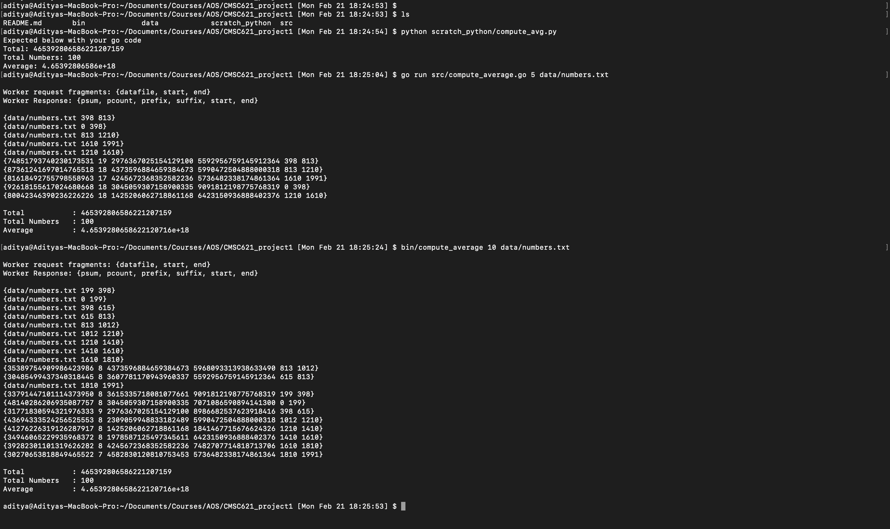

## Project Title

Multithreaded application to compute the average of the integers stored in a file

## Project Description

Program will take two command-line input parameters: M and fname. Here M is an integer and fname is the pathname (relative or absolute) to the input data file.
- The format of the input data file is: a sequence of 64-bit signed integers (can have ~20 digits) separated by white space, written in ASCII decimal text notation
- Program will spawn M workers threads and one coordinator thread
- The workers and the coordinator are implemented as goroutines in the GoLang, and communicates using channels
- The coordinator partitions the data file in M equal-size contiguous fragments; each kth fragment will be given to the kth worker via a JSON message of the form that includes the datafile's filename and the start and end byte position of the kth fragment, eg "{datafile: fname, start: pos1 , end: pos2}" for a fragment with the bytes in the interval [pos1, pos2).
- Each worker upon receiving its assignment via a JSON message it computes a partial sum and count which is the sum and count of all the integers which are fully contained within its assigned fragment. It also identifies a prefix or suffix of its fragment that could be part of the two integers that may have been split between its two adjacent (neighboring) fragments. Upon completion, the worker communicates its response to the coordinator via a JSON message with the partial sum and count, suffix, and prefix of its fragment, as well as it's fragments start and end eg: a worker whose assigned fragment that starts at 40, ends by 55, and contains "1224 5 8 10 678" will respond with the message "{psum: 23, pcount: 3, prefix: '1224 ', suffix: ' 678', start:40, end:55}"
- The coordinator, upon receving a response from each worker, accumulates all the workers's partial sums, counts, prefix, and suffix. The coordinator prints the average of the numbers in the datafile

## Setup Environment

Follow: [Download and install Go](https://go.dev/dl/)
Use Version: go1.17.7

## Run

```sh
cd <project directory>
e.g. cd /Users/aditya/Documents/Courses/AOS/CMSC621_project1

go run src/compute_average.go <M> <input_file_path>
e.g. go run src/compute_average.go 5 data/numbers.txt
```

OR binary can be used

```sh
cd <project directory>
e.g. cd /Users/aditya/Documents/Courses/AOS/CMSC621_project1

bin/compute_average <M> <input_file_path>
e.g. bin/compute_average 5 data/numbers.txt
```

## Project Directories

- **bin:** Directory containing a compiled binary
- **compute_average_screenshot.png:** Screenshot of working demo on my machine
- **data:** Placeholder directory to store input files containing integers
- **scratch_python:** Contains python script to generate input file with random numbers and calculates average to validate against go source
- **src:** Director containing go source

## Code Description - What Did I do?

I believe the code itself is very readable and well commented. I tried to note few more things below:

- tabwriter is just used for formatting the output and make it more readable
- Big Int and Big Float are used to store addition and average results because if all numbers are of 20 digits, addition of all of them might overflow for int64 or float64 datatypes
- initializeArgs checks if correct command line arguments provided, and initializes M and fname gathered from command line
- calcAverage is the coordinater routine, which spawns worker threads, loops over all workers and gathers response, it further computes the total and average
- spawnWorkers just distribute the workload to threads and actually call the worker routines
- To get the workload i.e. datafragment for each thread I simply multiply worker number (1..M) with partition size (obtained by filesize / M)
- I checked if the byte got by above multiplication is " ", if not I go on updating the end position of fragment till I hit " "
- For the last fragment, i.e., M, skipped the above logic and retured end position as filesize directly
- Please note, byte positions are 0 indexed
- calcFragmentTotal actually calculates the total of each fragment assigned to worker thread by looping over all numbers from the fragment except first (prefix) and last (suffix) number
- go channels are used for all the communication between worker and coordinater threads and jsons are passed across them as described in the project description above

## Demo


## References

- https://youtu.be/YS4e4q9oBaU
- https://gobyexample.com/reading-files
- https://gobyexample.com/worker-pools
- https://go.dev/blog/json
- https://go.dev/tour/concurrency/1
- https://go.dev/tour/concurrency/2
- https://golangcode.com/basic-channels/
- https://gobyexample.com/json
- https://pkg.go.dev/strconv
- https://stackoverflow.com/questions/2818884/raise-an-exception
- https://gobyexample.com/command-line-arguments
- https://gobyexample.com/writing-files
- https://pkg.go.dev/text/tabwriter
- https://blog.el-chavez.me/2019/05/05/golang-tabwriter-aligned-text/
- https://stackoverflow.com/questions/42494690/how-to-convert-golang-math-big-int-to-float
- https://medium.com/orbs-network/big-integers-in-go-14534d0e490d
- https://blog.devgenius.io/big-int-in-go-handling-large-numbers-is-easy-157cb272dd4f
- https://stackoverflow.com/questions/36797819/go-divide-big-float
